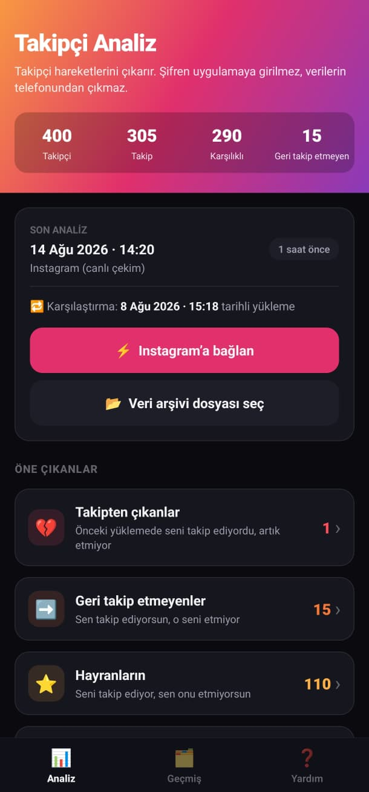
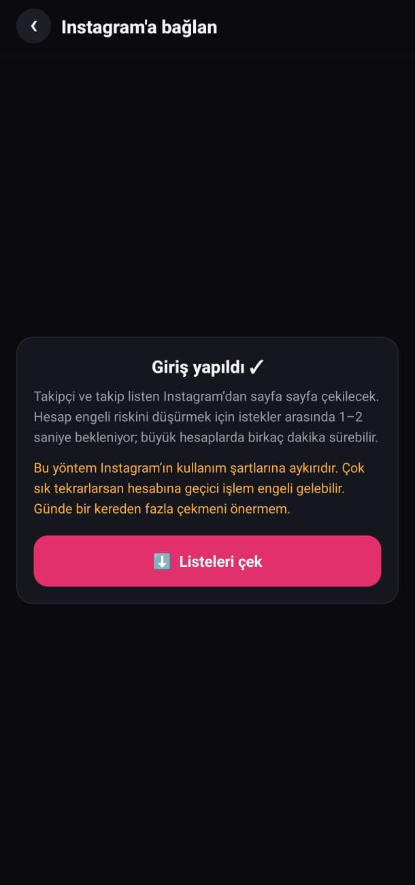
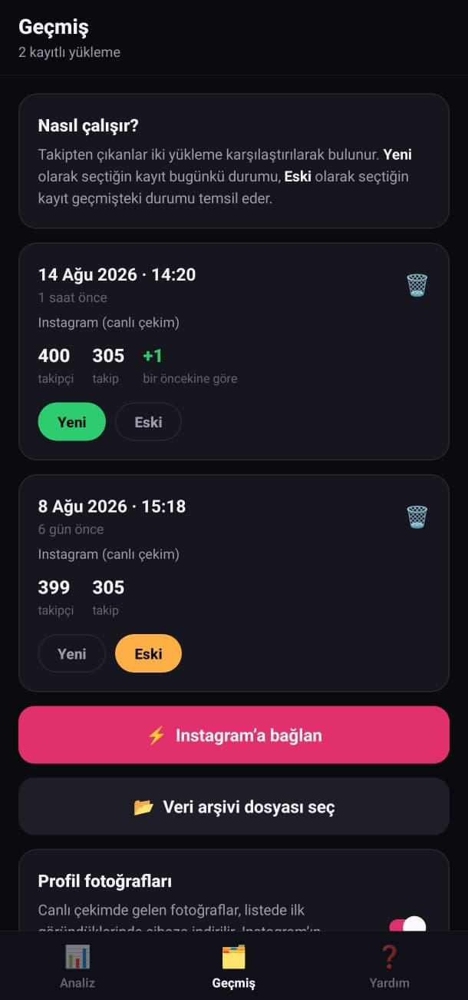

<div align="center">


# Takipçi Analiz

**Instagram'da seni takipten çıkanları ve geri takip etmeyenleri gösteren Android uygulaması.**
Sunucu yok, hesap yok, reklam yok — her şey telefonunda kalır.

[](https://github.com/bilalfarukozdemir/takipci-analiz/actions/workflows/ci.yml)
[](https://github.com/bilalfarukozdemir/takipci-analiz/releases/latest)
[](LICENSE)
[](https://github.com/bilalfarukozdemir/takipci-analiz/releases/latest)
[](https://docs.expo.dev/versions/v56.0.0/)

[**⬇️ APK indir**](https://github.com/bilalfarukozdemir/takipci-analiz/releases/latest) ·
[English](README.en.md) ·
[Katkı](CONTRIBUTING.md) ·
[Değişiklikler](CHANGELOG.md)

<br />

<table>
<tr>
<td align="center" valign="top" width="33%">

<br /><sub><b>Ana ekran</b><br />Özet sayılar, son çekim bilgisi ve<br />öne çıkan listeler</sub>
</td>
<td align="center" valign="top" width="33%">

<br /><sub><b>Instagram'a bağlan</b><br />Giriş Instagram'ın kendi sayfasında;<br />çekimden önce açık uyarı</sub>
</td>
<td align="center" valign="top" width="33%">

<br /><sub><b>Geçmiş</b><br />Kayıtlı çekimler ve hangi ikisinin<br />karşılaştırılacağı seçimi</sub>
</td>
</tr>
</table>

</div>

---

## Ne yapar?

| Liste | Açıklama |
| --- | --- |
| 💔 **Takipten çıkanlar** | Önceki çekimde takipçiydi, artık değil |
| ➡️ **Geri takip etmeyenler** | Sen takip ediyorsun, o etmiyor |
| ⭐ **Hayranların** | O seni takip ediyor, sen etmiyorsun |
| 🎉 **Yeni takipçiler** | Son çekimden bu yana takibe başlayanlar |
| 🤝 **Karşılıklı takip** | İki taraflı takipleşme |
| ⏳ **Bekleyen isteklerin** | Gönderdiğin, henüz onaylanmayan istekler |
| 📥 **Sana gelen istekler** | Onayını bekleyenler |
| 🚪 **Senin bıraktıkların** / ➕ **yeni takip ettiklerin** | İki çekim arası kendi hareketlerin |
| 💚 🚫 👥 | Yakın arkadaşlar, engellediklerin, tüm takipçi/takip listen |

Her listede: arama (kullanıcı adı + görünen ad), A→Z / Z→A / en yeni / en eski
sıralama, uzun basınca kullanıcı adını kopyalama, listeyi `.txt` olarak paylaşma,
hesaba dokununca profili Instagram'da açma, ✓ ile işaretleyip listeden gizleme.

Geçmiş sekmesinden istediğin **iki çekimi seçip karşılaştırabilirsin**.

## İki veri kaynağı

|  | ⚡ Canlı çekim | 📂 Veri arşivi |
| --- | --- | --- |
| Süre | birkaç dakika | dosyanın hazırlanmasını beklersin |
| Instagram kullanım şartları | **aykırı** | uygun |
| Hesap riski | sık kullanımda geçici işlem engeli | yok |
| Görünen ad | ✅ | ❌ |
| Profil fotoğrafı | ✅ | ❌ |
| Takip başlangıç tarihi | ❌ | ✅ |

İkisi de aynı analiz motoruna girer, kayıtlar tek geçmişte birikir, karışık
kullanılabilir.

### ⚡ Canlı çekim

Uygulama içinde **Instagram'ın kendi giriş sayfası** açılır (WebView). Şifre
uygulamaya girilmez, saklanmaz, hiçbir yere gönderilmez. Giriş sonrası sayfanın
içine enjekte edilen script, kullanıcının kendi oturumuyla Instagram web
arayüzünün kullandığı uçlara istek atar:

```
GET /api/v1/users/{uid}/info/
GET /api/v1/friendships/{uid}/followers/?count=50&max_id=…
GET /api/v1/friendships/{uid}/following/?count=50&max_id=…
```

Çerezler WebView'in dışına hiç çıkmaz. Engel riskini azaltmak için istekler
arasında **1,2–2,3 sn** (her 8 sayfada bir ek **3–5,5 sn**) rastgele gecikme
vardır. `401/403` → oturum düştü, `429` → hız sınırı olarak ayrı ele alınır;
75 sn yanıt gelmezse zaman aşımı devreye girer.

> [!WARNING]
> Canlı çekim Instagram'ın kullanım şartlarına aykırıdır. Sık kullanırsan hesabına
> geçici işlem engeli gelebilir (genelde birkaç saatte kalkar). Günde birden fazla
> çekme. Riski tamamen istemiyorsan veri arşivi yöntemini kullan.

Uygulamada **toplu takipten çıkarma yoktur** ve bilerek eklenmemiştir — engel
yemenin en hızlı yolu odur.

### 📂 Veri arşivi

1. Instagram → Profil → ☰ → **Ayarlar ve gizlilik** → **Hesap Merkezi**
2. **Bilgileriniz ve izinleriniz** → **Bilgilerini indir** → **Bilgileri indir**
3. Hesabını seç → **Bilgilerinin bir kısmını seç** → sadece
   **"Takipçiler ve takip edilenler"**
4. Tarih aralığı *Tüm zamanlar*, format **JSON** → **Dosya oluştur**
5. Gelen `.zip` dosyasını uygulamada seç

Sadece takipçi verisi seçilirse arşiv genelde dakikalar içinde gelir. Tümünü
seçersen günler sürer ve yüzlerce MB olur.

Desteklenen biçimler: modern JSON (`followers_1.json`, `following.json`, çok
parçalı dosyalar dahil), HTML çıktısı, 2020 öncesi `connections.json`. Zip'i açıp
JSON dosyalarını tek tek seçmek de çalışır.

## Takipten çıkanlar neden ikinci çekimden sonra çıkıyor?

Instagram bu bilgiyi hiçbir yerde vermiyor — ne veri arşivinde ne arayüzünde
"kim seni takipten çıktı" diye bir kayıt var. Tek yol, iki farklı zamandaki
takipçi listesini karşılaştırmak. İlk çekim başlangıç noktası olur; ikinciden
itibaren liste dolar.

## Profil fotoğrafları

Instagram'ın fotoğraf adresleri imzalıdır ve birkaç gün içinde geçersiz olur.
Bu yüzden sadece adres saklanmaz: fotoğraf **listede ilk göründüğünde** cihaza
indirilip kalıcı olarak saklanır. Sonrasında internet olmadan da görünür ve eski
kayıtlarda kaybolmaz.

Sadece kaydırdığın kadarı iner (aynı anda en fazla 4 indirme, en son görünen satır
öncelikli). Geçmiş sekmesinden kapatabilir veya indirilenleri silebilirsin.
Kabaca 1000 hesap ≈ 8 MB.

## Gizlilik

- Sunucu yok, analitik yok, reklam yok, hesap oluşturma yok.
- Tüm veriler cihazın içinde (SQLite + dosya sistemi) saklanır.
- İnternete çıkan tek trafik: Instagram'ın kendisi (canlı çekim + profil
  fotoğrafları) ve senin açtığın bağlantılar.
- Uygulamayı silersen tüm kayıtlar da silinir.

## Kurulum

### Kullanıcıysan

[Releases](https://github.com/bilalfarukozdemir/takipci-analiz/releases/latest)
sayfasından APK'yı indir, telefonda dosyaya dokun, "bilinmeyen kaynaklardan
yüklemeye" izin ver. Android 7.0 (API 24) ve üzeri gerekir.

### Geliştiriciysen

```bash
git clone https://github.com/bilalfarukozdemir/takipci-analiz.git
cd takipci-analiz
npm install
npm start
```

Gerekenler: Node 20+, JDK 17, Android SDK (API 36 / build-tools 36.x).

| Komut | Ne yapar |
| --- | --- |
| `npm start` | Expo geliştirme sunucusu |
| `npm run android` | Cihaz/emülatörde geliştirme derlemesi |
| `npm run typecheck` | TypeScript denetimi |
| `npm test` | Arşiv çözümleyici testleri (33 kontrol) |
| `npm run apk` | İmzalı release APK üretir |

## APK üretme

```bash
npm run apk
```

APK proje köküne `takipci-analiz.apk` olarak kopyalanır.

> [!NOTE]
> **Windows'ta uzun/boşluklu yol sorunu.** Android NDK'nın kullandığı CMake/ninja,
> yolu uzun ya da boşluk içeren projelerde native modülleri derleyemez
> (`ninja: error: manifest 'build.ninja' still dirty after 100 tries`).
> [`scripts/build-apk.ps1`](scripts/build-apk.ps1) bu yüzden kaynağı `C:\rnb\takipci`
> gibi kısa bir yola aynalar, derlemeyi orada yapar ve APK'yı geri kopyalar.
> Farklı klasör için `TAKIPCI_BUILD_DIR` ortam değişkenini ayarla. Kaynak kodu her
> zaman kendi klasöründe düzenle; ayna otomatik güncellenir.

İmzalama için bkz. [`credentials/README.md`](credentials/README.md). Anahtar yoksa
derleme yine çalışır, APK debug anahtarıyla imzalanır.

### EAS Build ile (bulutta)

```bash
npx eas login
npx eas build -p android --profile preview   # APK
npx eas build -p android --profile production # Play Store için .aab
```

## Mimari

```
App.tsx                       kök bileşen: sekmeler, yönlendirme, içe aktarma akışı
src/
  lib/
    parse.ts                  veri arşivini çözümleme (zip / json / html / eski format)
    analyze.ts                küme işlemleri + 14 kategori tanımı
    igLive.ts                 WebView'e enjekte edilen canlı çekim script'i
    importer.ts               dosya seçici + dosya okuma
    avatars.ts                profil fotoğrafı önbelleği (tembel indirme + disk)
    storage.ts                anlık görüntüler ve ayarlar (expo-sqlite/kv-store)
    ig.ts                     profil açma, kopyalama, paylaşma
    fmt.ts                    Türkçe tarih/sayı biçimleme
  screens/
    Home.tsx                  özet, kategori kartları
    ListScreen.tsx            arama + sıralama + liste
    Connect.tsx               Instagram girişi ve çekim ilerlemesi
    History.tsx               çekim geçmişi, karşılaştırma seçimi, ayarlar
    Help.tsx                  rehber ve SSS
  ui/                         ortak bileşenler (kit, UserRow, Credit)
  theme.ts                    renkler, ölçüler, sürüm ve künye sabitleri
  types.ts                    veri tipleri
plugins/                      Expo prebuild config plugin'leri
  withTurkishAppName.js         ekranda görünen Türkçe uygulama adı
  withInstagramQuery.js         instagram:// için Android paket görünürlüğü
  withBuildTuning.js            sadece ARM mimarileri (APK ~30 MB küçülür)
  withReleaseSigning.js         release imzalama yapılandırması
scripts/build-apk.ps1         kısa yolda derleme + APK'yı geri kopyalama
tests/parse.test.js           çözümleyici testleri
```

Veri akışı her iki kaynakta da aynı: `parse.ts` / `igLive.ts` → `SnapshotData` →
`storage.ts` (cihaza kaydet) → `analyze.ts` (iki anlık görüntüyü karşılaştır) →
ekranlar.

## Testler

```bash
npm test
```

`tests/parse.test.js` gerçek Instagram arşiv biçimleriyle 33 kontrol çalıştırır:
modern JSON, çok parçalı `followers_1/2.json`, HTML çıktısı, 2020 öncesi
`connections.json`, bozuk dosyalar, tanınmayan dosya adları, büyük/küçük harf
eşleşmesi, tekilleştirme ve fark analizi.

## Yasal uyarı

Bu proje Instagram, Meta Platforms Inc. veya bağlı kuruluşlarıyla **hiçbir
ilişkisi olmayan**, bağımsız bir çalışmadır. "Instagram" adı ve logosu Meta
Platforms Inc.'e aittir.

Uygulama kişisel kullanım için yazılmıştır. Canlı çekim özelliği Instagram'ın
kullanım şartlarına aykırıdır; bu özelliği kullanmanın sonuçlarından kullanıcı
sorumludur. Yazılım MIT lisansıyla, **hiçbir garanti verilmeden** sunulur.

## Katkı

Katkılar açıktır — hata bildirimi, çeviri, yeni arşiv biçimi desteği, kod.
Başlamadan önce [CONTRIBUTING.md](CONTRIBUTING.md) dosyasına göz at.
Güvenlik açığı bulduysan [SECURITY.md](SECURITY.md) yolunu izle.

## Lisans

[MIT](LICENSE) © 2026 Bilal Faruk Özdemir

---

<div align="center">

Yapımcı: [**vitrincim.com**](https://vitrincim.com)

</div>

---

## Destek

[](https://github.com/sponsors/bilalfarukozdemir)

Bu proje ücretsiz ve ücretsiz kalacak. İşine yaradıysa
[sponsor olabilirsin](https://github.com/sponsors/bilalfarukozdemir); bir yıldız
ya da iyi bir hata bildirimi de en az onun kadar kıymetli.

---

## Künye

| | |
|---|---|
| Bakım | Tek geliştirici, boş zamanlarında — [@bilalfarukozdemir](https://github.com/bilalfarukozdemir) |
| Finansman | Yok. Reklam, telemetri ve ücretli sürüm yok; tek gelir kalemi [GitHub Sponsors](https://github.com/sponsors/bilalfarukozdemir) |
| Durum | Aktif geliştiriliyor |
| Lisans | MIT |
| Destek | Hata bildirimleri okunur ve ele alınır. Yanıt süresi taahhüdü ve garanti yoktur |
